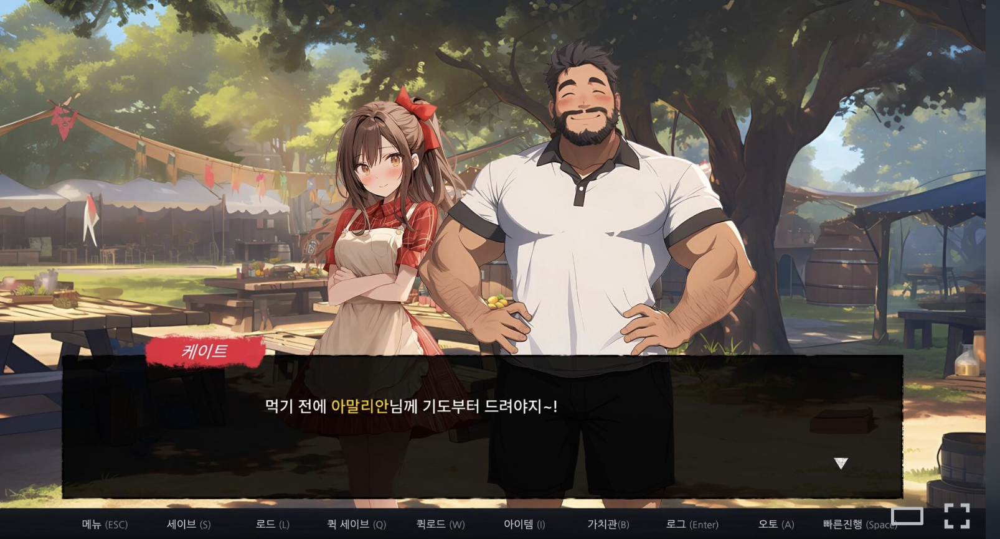
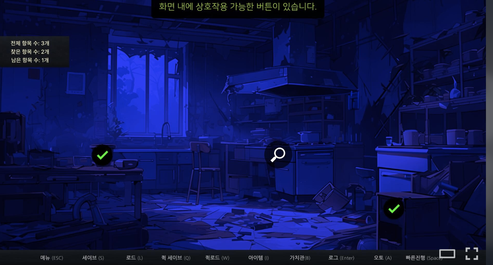
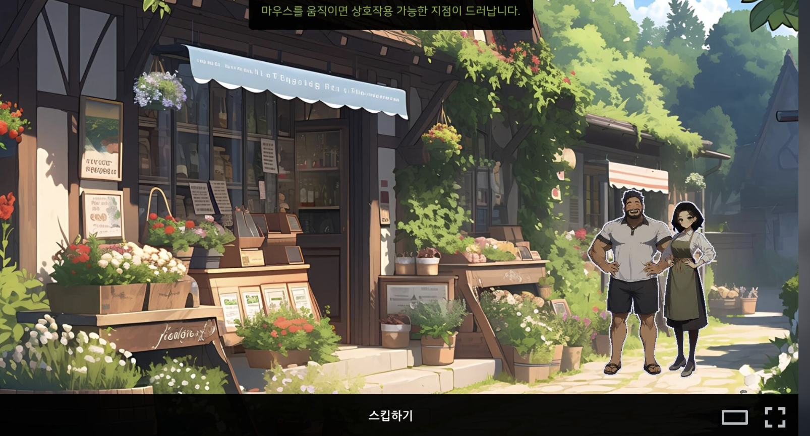
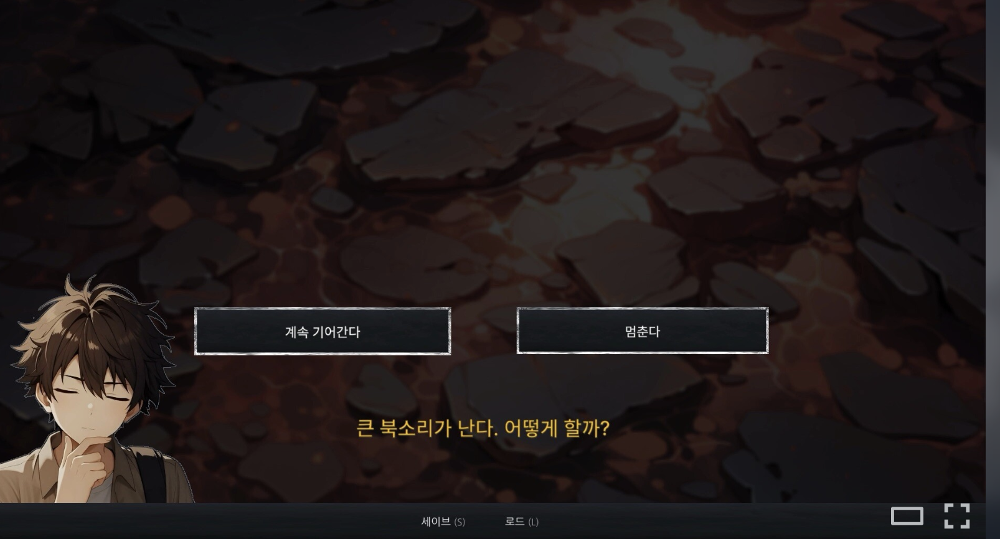

# The Secret Of Greenwood Isle (그린우드 섬의 비밀)

A story adventure game I developed solo over one year and released on Steam and STOVE in January 2026. Crowdfunded on Tumblbug, reaching 104% of its goal.

- Steam: [store.steampowered.com/app/3790450](https://store.steampowered.com/app/3790450/The_Secret_Of_Greenwood_Isle/)
- STOVE: [store.onstove.com/ko/games/103717](https://store.onstove.com/ko/games/103717)
- More about the project: [developersayne.dev](https://developersayne.dev)

> Selected C# source, published for portfolio review. Not a complete project, and it
> does not build as-is. Comments were translated to English.

  
  

  
  

## What is here

| | |
|---|---|
| [`StoryEngine/Core/`](StoryEngine/Core) | Fail-fast singleton base: throws on uninitialized access instead of auto-creating, distinguishes true null from Unity's destroyed-object null, and stops the editor when DontDestroyOnLoad would be silently ignored. |
| [`StoryEngine/Elements/`](StoryEngine/Elements) | The unit a scene is made of: dialogue, item gain, and the composites that nest them. |
| [`StoryEngine/Story/`](StoryEngine/Story) | Story data, the player that runs one, and the branch conditions between them. |
| [`StoryEngine/Choices/`](StoryEngine/Choices) | Choice elements and the window they open. |
| [`StoryEngine/Interactions/`](StoryEngine/Interactions) | Hotspot investigation: buttons on the scene, waiting until all are found. |
| [`StoryEngine/SaveLoad/`](StoryEngine/SaveLoad) | Save format, slot reads and writes, and restoring a story mid-way. One SaveData object is the whole game state: managers bind to it and keep no copies of their own. |
| [`Editor/Parameters/`](Editor/Parameters) | Code generator that scans character prefabs and settings assets into const-string registries, so story scripts reference IDs the compiler checks. |
| [`Editor/StoryFlow/`](Editor/StoryFlow) | Unity GraphView window the narrative is authored in. Nodes are the story assets, edges are their next-card fields. |
| [`Settings/`](Settings) | Settings registry keyed by type, one value object per setting, and the binder layer that connects each type to its widget. The panel above sees only the base binder, so it never learns which setting is a float and which is a bool. |
| [`UIWidgets/`](UIWidgets) | Dialogue box, typewriter reveal, and slider/toggle widgets that render an injected `ReactiveProperty` and own no state of their own. |

## Stack

Unity, C#, UniTask, UniRx, DOTween, Newtonsoft.Json, Steamworks.NET, Unity GraphView.

Visual and audio assets were produced with generative tools and integrated by hand. Nothing is generated at runtime. Matches the disclosure on the Steam store page.

## Author

Jinhyung Kang (Sayne) · [developersayne.dev](https://developersayne.dev) · sayneinteractive@gmail.com
